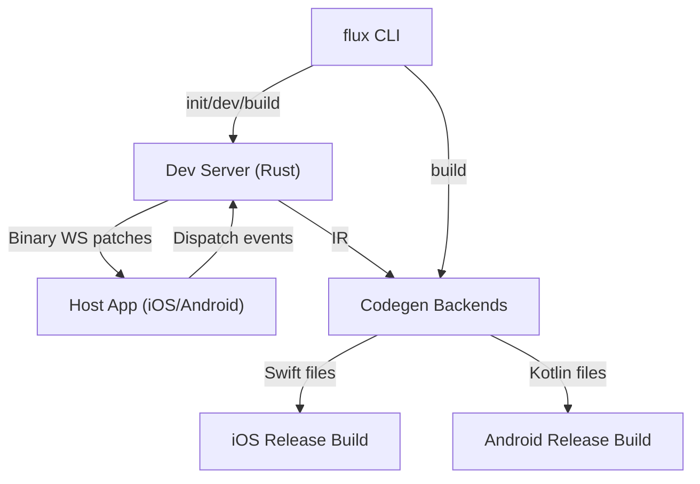
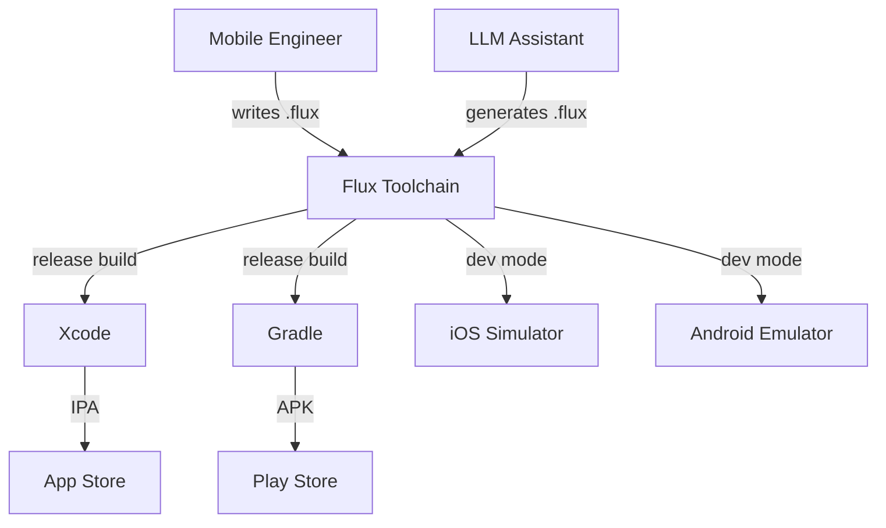
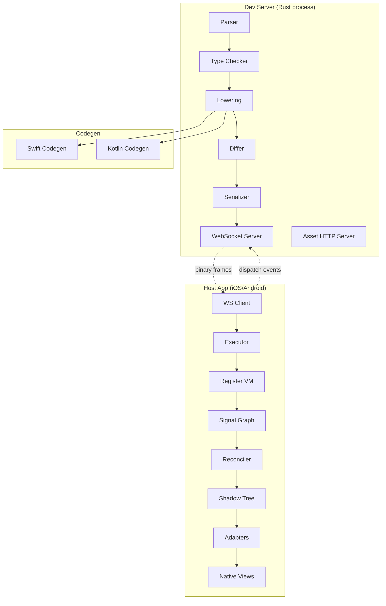

# Flux — Comprehensive Specification Suite (MLP)

| Field | Value |
|-------|-------|
| Project | Flux — Native Cross-Platform UI Development System |
| Document | Comprehensive Specification Suite (Vision + BRS + SRS + Architecture + Verification) |
| Version | 0.1.0 (Draft) |
| Date | 2025-01-18 |
| Author | Architecture Team (assisted by AI) |
| Status | Draft — Pending Review |
| Scope | Minimum Lovable Product (MLP): Static types, generics, iOS + Android, navigation, embedded interpreter hot-swap |

---

# Part I — Vision & Strategic Alignment

## 1. Vision & Elevator Pitch

**Vision.** Make native iOS and Android development as fast as web development, without sacrificing native performance, native feel, or developer ergonomics — and without locking teams into a proprietary runtime.

**Elevator Pitch.** For mobile engineering teams who are dissatisfied with the iteration speed of native compilation and the native feel of cross-platform frameworks, Flux is a write-once UI language with a Rust-based dev server and precompiled host apps that delivers sub-100ms hot-swap iteration in development and compiles to idiomatic Swift/SwiftUI and Kotlin/Jetpack Compose in release. Unlike Flutter (custom renderer), React Native (JS runtime), or Compose Multiplatform (Kotlin/Native overhead on iOS), Flux ships a binary reactive tree over WebSocket to a precompiled host interpreter in dev, and generates native platform code in release — giving you native performance and platform-idiomatic UI with web-class iteration speed.

## 2. Problem & Business Context

**Problem.** Native iOS and Android development suffers from slow iteration cycles (5–30 seconds per edit due to recompilation, relinking, reinstallation, and relaunch). Existing cross-platform solutions trade native feel for speed (Flutter), ship a JS runtime with bridge overhead (React Native), or use a single language with runtime overhead on one platform (Compose Multiplatform's Kotlin/Native on iOS).

**Why now?** Three forces converge:
1. **LLM-assisted development** demands terse, token-efficient languages — existing UI DSLs were designed for humans in 2015.
2. **Fine-grained reactivity** (SolidJS) has matured; the reactive runtime can be embedded in a precompiled host app without shipping a full language runtime.
3. **Binary protocols over WebSocket** are proven (LiveView Native, Mach 9) for shipping reactive trees to native hosts.

**Drivers:**
- Increasing team pressure to ship on both iOS and Android with one codebase.
- Growing LLM-assisted development making token economy a first-class concern.
- Platform convergence on declarative UI (SwiftUI, Jetpack Compose) making codegen tractable.

## 3. Target Users & Customers

**Primary user class:** Mobile engineers at product companies (50–500 engineers) building consumer or B2B apps that must ship native on both iOS and Android.

**Secondary user class:** Solo developers and small startups who want native feel without maintaining two codebases.

**Explicitly NOT targeting (non-goals):**
- Web frontend developers (Flux is mobile-native only).
- Game developers (Flux is for app UI, not canvas rendering).
- Enterprise teams with heavy legacy native code (migration path is out of scope for MLP).

## 4. Goals & Non-Goals

### Goals (MLP)
1. **Sub-100ms save-to-pixels** on a 50-node screen on both iOS simulator and Android emulator.
2. **State preservation** across handler-body edits, component reloads, and navigation.
3. **Dev/release parity** — same `.flux` source produces visually identical output in dev (executor) and release (SwiftUI/Compose codegen).
4. **Native release output** — generated Swift and Kotlin that is idiomatic and readable.
5. **Static type system with generics** — Hindley-Milner-ish inference, type classes, ADTs.
6. **LLM-friendly syntax** — terse, indentation-optional, explicit-where-it-matters.

### Non-Goals (MLP)
1. **Custom renderer.** No Skia, no canvas. Native views only.
2. **CSS-like styling.** No `display: flex`. Platform-idiomatic layout only.
3. **100% platform parity.** 95% of platform UI is the target; escape hatches are documented.
4. **Plugin/extension system.** Adapters and capabilities are first-party only for MLP.
5. **Animations, gestures beyond tap, virtualized lists.** Deferred to MLP v2.
   > **Credibility note (v1 scope trade-off, not a value judgment):** These three are
   > the features users viscerally associate with *native feel* — Flux's core wedge
   > vs. Flutter/RN. Cutting them for v1 is a deliberate scope decision, but it is the
   > primary credibility gap and the top candidate for the v1.1 / v2 fast-follow. The
   > architecture does not preclude them: gestures map to native gesture recognizers,
   > animations to native `withAnimation`/`animate*`, and virtualization to native
   > `LazyVStack`/`LazyColumn` — all are adapter-level additions, not VM changes.
6. **Async/await syntax.** Callbacks only for MLP.
7. **Package management / third-party libraries.** Local files only.
8. **i18n, RTL, dark mode theming.** Deferred.
9. **LSP integration.** CLI and error overlay only.

## 5. Strategic Constraints

| Constraint | Detail |
|---|---|
| **Platform floors** | iOS 16+ (NavigationStack, @Observable), Android API 24+ (Compose) |
| **Dev server OS** | macOS, Linux, Windows (Rust) |
| **Host app distribution** | Sideload via Xcode / direct APK; TestFlight for team sharing |
| **Team size assumption** | 1–3 engineers for MLP build; designed for 5–50 engineers at scale |
| **Budget** | **MLP v1 (shippable)** ≈ 12–16 weeks, one strong engineer (parallelize iOS/Android at week 11). **Full system** (parser + bidirectional typechecker + monomorphization + arena IR + differ + MessagePack wire + devserver + Swift & Kotlin native codegen + 3-way VM parity) is a 4–6 month, multi-engineer program — see `/docs/agents-boundaries-contract.md` (23 issues, 7 phases, up to 9 parallel agents). The 12–16 week figure is the *minimum lovable* target, not the full toolchain. |
| **License** | Open source (MIT or Apache 2.0) — TBD |

## 6. Success Metrics

| Metric | Target | Verification |
|---|---|---|
| Save-to-pixels latency (50-node screen) | < 100 ms | Benchmark on iPhone 13 Pro simulator |
| Tap-to-state-change latency | < 8 ms | Benchmark on mid-range Android emulator |
| State preservation across 1000 edits | No leaks, < 50 MB growth | Memory benchmark |
| Dev/release visual parity | Pixel-identical for 5 primitives | Visual snapshot comparison |
| Generic specialization | `Counter[Int]` and `Counter[Float]` produce distinct bytecode | Bytecode inspection |
| Navigation state survives hot-swap | Push → edit → pop preserves state | Integration test |

---

# Part II — Business & Stakeholder Requirements

## 7. Business Context

Flux is an internal/open-source toolchain, not a SaaS product. Its "business" is developer productivity. The BRS focuses on stakeholder needs rather than market dynamics.

## 8. Stakeholders & User Classes

| Stakeholder | Concerns | Influence |
|---|---|---|
| Mobile engineer (primary) | Iteration speed, native feel, code maintainability | High |
| Engineering manager | Team velocity, hiring pool, tech debt | High |
| Designer | UI fidelity to mockups, platform consistency | Medium |
| LLM/AI assistant | Token economy, API discoverability, schema export | Medium (novel) |
| Open-source contributor | Code clarity, contribution guide, ADR transparency | Medium |

## 9. Business Rules & Policies

| ID | Rule |
|---|---|
| BR-001 | Generated Swift must be readable and maintainable by a Swift developer who has never seen `.flux`. |
| BR-002 | Generated Kotlin must be readable and maintainable by a Kotlin developer who has never seen `.flux`. |
| BR-003 | The dev server must never crash the host app. Errors in `.flux` source must not propagate as native crashes. |
| BR-004 | The host app must never require recompilation during development. All iteration happens via binary patches. |
| BR-005 | Release builds must contain no interpreter, no WebSocket client, no dev-server code. The binary is pure native. |

## 10. Glossary

| Term | Definition |
|---|---|
| **RT-IR** | Reactive Tree Intermediate Representation — the canonical data structure representing a compiled `.flux` component tree. |
| **Shadow tree** | The host app's in-memory mirror of the IR, holding native view instances. |
| **Adapter** | A platform-native class (Swift/Kotlin) that bridges an IR node kind to a native view (e.g., `FluxButtonAdapter` wraps `UIButton`/`android.widget.Button`). |
| **ClosureIR** | The bytecode/AST representation of a handler body, shipped as data to the host VM. |
| **Signal** | A fine-grained reactive cell (à la SolidJS) holding a value; mutations propagate to subscribers. |
| **Handler** | A reactive closure fired on user events (tap, change). Hot-swappable without recompilation. |
| **Capability** | A platform-specific API (camera, storage, navigation) declared in `.flux` and bound per-platform. |
| **Monomorphization** | The dev server's process of specializing generic code per concrete type instantiation. |
| **Parity** | The property that dev-mode (executor) and release-mode (codegen) produce identical visible behavior. |

---

# Part III — Software Requirements

## 11. System Context



**External systems:**
- Xcode (`xcodebuild`) — compiles generated Swift + host app into IPA.
- Gradle — compiles generated Kotlin + host app into APK.
- Editor (user's choice) — edits `.flux` files; file watcher triggers dev server.

## 12. Functional Requirements

### FR-001: Parse `.flux` source
The dev server shall parse `.flux` files into a typed AST within 5 ms for a 500-line file.

### FR-002: Type-check with generics
The type checker shall perform bidirectional type checking with let-polymorphism and type class resolution. All generic instantiations shall be recorded for monomorphization.

### FR-003: Lower AST to RT-IR
The lowering pass shall produce a Reactive Tree IR with stable node IDs derived from source structure (component path + source span + key).

### FR-004: Diff IR trees
The differ shall produce a minimal `Patch[]` list comparing the previous IR to the new IR. The algorithm shall be O(n) for typical cases using keyed reconciliation (udomdiff-style).

### FR-005: Serialize patches as binary frames
The serializer shall pack `Patch[]` into a binary frame using MessagePack encoding with content-addressed interning for props, closures, and string IDs.

### FR-006: Ship frames over WebSocket
The dev server shall maintain a WebSocket connection to the host app on `ws://localhost:7331` (configurable). Frames shall be delivered within 2 ms on localhost.

### FR-007: Host app receives and applies patches
The host app's executor shall receive binary frames, deserialize them, apply structural patches to the shadow tree, hot-swap handler closures in the closure table, and dispatch native view mutations to the main thread.

### FR-008: Host app evaluates handlers via embedded VM
When a native event fires (tap, change), the adapter shall call `executor.dispatch(handlerId)`. The executor shall look up the `ClosureIR` in its closure table and evaluate it via the embedded register-based bytecode VM against the signal graph.

### FR-009: Signal propagation
Signal writes shall propagate to dependent derived cells and effects in topological order. Propagation shall be batched within a single dispatch (all writes in one handler evaluation are buffered; propagation happens once after the handler returns).

### FR-010: Native view mutation
The reconciler shall translate dirty signal nodes into native view mutations (e.g., `TextView.setText(...)`, `UILabel.text = ...`). Mutations shall be batched within a single frame (coalesced via `DispatchQueue.main.async`).

### FR-011: Codegen Swift
The Swift codegen backend shall consume RT-IR and emit idiomatic SwiftUI code. Generated code shall:
- Use `struct ViewName: View` for components.
- Use `@State` for state, `let` for props.
- Use `VStack`/`HStack` for `Column`/`Row`.
- Use `if/else` inside `@ViewBuilder` for `when` blocks.
- Use `NavigationStack(path:)` for `Router`.

### FR-012: Codegen Kotlin
The Kotlin codegen backend shall consume RT-IR and emit idiomatic Jetpack Compose code. Generated code shall:
- Use `@Composable fun` for components.
- Use `mutableStateOf`/`remember` for state.
- Use `Column`/`Row` for `Column`/`Row`.
- Use `NavHost` for `Router`.

### FR-013: Navigation
The `Router` adapter shall maintain a stack of screens. Pushing a screen shall preserve the previous screen's shadow tree in memory. Popping shall destroy the shadow tree. Hot-swaps shall apply to hidden screens' shadow subtrees.

### FR-014: Asset pipeline
The dev server shall serve assets (images, fonts) over HTTP on a separate port (default 7332). The host app's `Image` adapter shall load from `http://localhost:7332/assets/...`. In release, codegen shall emit platform-native asset references (`Image("logo")` for Swift, `painterResource(R.drawable.logo)` for Kotlin).

### FR-015: Error reporting
Parse errors, type errors, and VM runtime errors shall be reported both to the CLI (Rust-style diagnostics with file:line:col) and to the device (red banner overlay with error message and source span). The previous good tree shall remain visible underneath the banner.

### FR-016: Cold start
On first connection, the host app shall send a `Hello` frame with protocol version and capability list. The dev server shall validate and respond with an `Init` frame containing the full IR tree + state seed + source map. Target: < 300 ms from app launch to first frame on a 50-node screen.

### FR-017: Reconnect
On WebSocket disconnect, the host app shall show a "Reconnecting..." banner and retry every 1 second. On reconnect, the dev server shall send an `Init` frame. State shall be restored from the dev server's signal graph.

### FR-018: Background app lifecycle
On iOS `applicationWillResignActive`, the host app shall show a "Dev paused" indicator and stop rendering updates. On `applicationDidBecomeActive`, the host app shall reconnect the WebSocket and request an `Init` frame.

## 13. Quality & Non-Functional Requirements

### NFR-PERF-001: Save-to-pixels latency
Under normal development load (50-node screen, localhost WebSocket), 95% of file saves shall produce visible pixels within 100 ms on an iPhone 13 Pro simulator.

### NFR-PERF-002: Tap-to-state-change latency
When a user taps a button, the signal graph mutation and native view update shall complete within 8 ms on a mid-range Android emulator (Pixel 5 emulator, API 34).

### NFR-PERF-003: VM dispatch overhead
A single handler dispatch (lookup + evaluate + propagate) shall complete within 2 ms for a handler body of < 50 instructions on an iPhone 13 Pro.

### NFR-PERF-004: Wire payload size
A typical handler-body-change patch shall be < 500 bytes. A typical structural patch (insert one node) shall be < 1 KB. A full tree reconnect (50 nodes) shall be < 20 KB.

### NFR-RELI-001: State preservation
State values shall be preserved across handler-body edits, prop value edits, and structural inserts that do not change the component's source ID. State shall be reset on component type change, state type change, or state rename.

### NFR-RELI-002: No host app crashes
VM runtime errors (index out of bounds, null dereference, gas exhaustion, memory exhaustion) shall be caught by a top-level handler in `executor.dispatch()` and reported as error frames. The host app shall never crash due to a `.flux` source error.

### NFR-SEC-001: VM sandboxing
The VM shall have no `CALL_NATIVE` instruction. The only mechanism for calling platform APIs is `CALL_CAP` with a capability ID. Capabilities are pre-vetted and bound per-platform. The VM cannot call arbitrary native APIs.

### NFR-SEC-002: Gas meter
Each handler dispatch shall have an instruction budget of 100,000 instructions. On exhaustion, the VM shall raise a `GasExhausted` error.

### NFR-SEC-003: Memory cap
The VM shall allocate from a fixed pool of 16 MB per component instance. On exhaustion, allocation shall fail with a `MemoryExhausted` error.

### NFR-MAINT-001: Dev/release parity
For any `.flux` source, the dev-mode executor and the release-mode codegen shall produce behaviorally identical output. Parity shall be verified by an automated test harness that runs the same actions in both modes and compares state.

**Scope adjudication (resolves tension with ADR-0003):** The behavioral-contract parity above is binding for *all* observable node values, props, handlers, signal state, and VM execution semantics — these must match exactly between dev and release. ADR-0003 ("Dev/release layout *may* diverge in edge cases") is explicitly the **narrow exception** and applies *only* to pixel-level native layout geometry (e.g., text wrapping at different breakpoints, platform-specific spacing/margins). Where a conflict arises, the rule is: **node tree + behavior + VM semantics = identical (hard NFR); native layout rendering = best-effort, may differ in edge cases (ADR-0003).** The parity harness asserts the former; it must not over-constrain the latter.

### NFR-MAINT-002: Generated code readability
Generated Swift and Kotlin shall be formatted with platform-standard formatters (swift-format, ktlint) and shall be readable by a developer unfamiliar with `.flux`.

### NFR-PORT-001: Platform support
MLP shall support iOS 16+ and Android API 24+. Platform-specific features requiring newer versions shall degrade gracefully.

### NFR-OBS-001: Logging levels
The CLI shall support `--log-level` with levels: `info` (default), `debug` (includes IR diffs), `trace` (includes every VM instruction).

### NFR-OBS-002: Profiling
The CLI shall support `--profile` which prints a flamegraph of the hot-swap pipeline: parse, type-check, lower, diff, serialize, send, apply, VM eval, propagate, native apply.

## 14. External Interfaces

### 14.1 WebSocket Protocol
- Transport: WebSocket binary frames
- Default URL: `ws://localhost:7331`
- Frame encoding: MessagePack
- Protocol version: u32 (in Hello frame)

### 14.2 Asset HTTP Server
- Transport: HTTP/1.1
- Default port: 7332
- Serves from project's `assets/` directory

### 14.3 CLI
- `flux init <name>` — scaffold project
- `flux dev` — start dev server + file watcher
- `flux build --platform ios|android` — codegen + platform build
- `flux doc` — emit JSON schema of stdlib API (for LLM consumption)

### 14.4 Editor integration
- File watcher: uses `notify` crate (cross-platform filesystem events)
- Click-to-jump: host app sends IR node ID; dev server maps to source span; opens editor via `flux open <file>:<line>` or editor-specific protocol

## 15. Constraints, Assumptions & Dependencies

### C-001: Rust toolchain
Dev server is built with Rust 1.75+. No unstable features.

### C-002: Swift toolchain
iOS host app and codegen target Swift 5.9+. Uses `@Observable` (iOS 17+) with fallback to `ObservableObject` for iOS 16.

### C-003: Kotlin toolchain
Android host app and codegen target Kotlin 1.9+. Uses Compose BOM 2024.01+.

### C-004: No CGO in dev server
The dev server is pure Rust (no CGO dependencies) for cross-platform compilation.

### A-001: LLM adoption
Assumes LLM-assisted development will be a significant fraction of `.flux` authoring. Token economy is a first-class design constraint.

### A-002: Localhost dev
Assumes the dev server runs on the same machine as the simulator/emulator. Device testing over LAN is supported but not the primary target.

---

# Part IV — Architecture & Design

## 16. Architecturally Significant Requirements (ASRs)

| ASR ID | Requirement | Architectural Impact |
|---|---|---|
| ASR-001 | Sub-100ms save-to-pixels | Demands binary protocol, precompiled VM, arena IR, content addressing |
| ASR-002 | Native release output (Swift/Kotlin) | Demands IR as contract, dual codegen backends, parity testing |
| ASR-003 | State preservation across edits | Demands stable node IDs, tombstones, keyed reconciliation |
| ASR-004 | VM must not crash host app | Demands gas meter, memory cap, top-level catch, sandboxed ISA |
| ASR-005 | LLM-friendly syntax | Demands terse grammar, explicit annotations, schema export |
| ASR-006 | Dev/release parity | Demands single IR, adapter contract, automated parity harness |
| ASR-007 | Static types with generics | Demands bidirectional checker, monomorphization, type class resolution |

## 17. System Overview (C4 Model)

### C1 — System Context



### C2 — Container View



### C3 — Component View (Dev Server)

```mermaid
graph TB
    subgraph "flux-devserver crate"
        Watcher[File Watcher<br/>notify crate]
        ParserCrate[flux-parser<br/>pest grammar]
        TypeCrate[flux-types<br/>bidirectional checker]
        IRCrate[flux-ir<br/>arena-allocated]
        DifferCrate[flux-differ<br/>keyed reconciliation]
        SerdeCrate[flux-ir-serde<br/>MessagePack]
        WSCrate[flux-devserver<br/>tokio-tungstenite]
    end

    Watcher -->|file events| ParserCrate
    ParserCrate -->|AST| TypeCrate
    TypeCrate -->|typed AST| IRCrate
    IRCrate -->|RT-IR| DifferCrate
    DifferCrate -->|Patch[]| SerdeCrate
    SerdeCrate -->|binary frame| WSCrate
```

## 18. The `.flux` Language

### 18.1 Grammar

**Design principles:**
- Braces with optional indentation enforcement via formatter.
- Named props (Kotlin-style) — no positional args.
- Rust-ish type annotations (`:` for annotation, `->` for return).
- Square brackets for generics.
- Pipe-prefix for ADT variants.
- Single-brace string interpolation.

**Concrete grammar (pest):**

```pest
// Top-level
file        = { SOI ~ statement* ~ EOI }
statement   = { component | fn_decl | type_decl | trait_decl | import | use }
import      = { "import" ~ ident ~ "from" ~ string_lit }
use         = { "use" ~ path ~ ("::" ~ "*")? }

// Components
component   = { "component" ~ ident ~ generic_params? ~ props_block? ~ block }
props_block = { "(" ~ prop_decl ~ ("," ~ prop_decl)* ~ ")" }
prop_decl   = { ident ~ ":" ~ type }

// Functions
fn_decl     = { "fn" ~ ident ~ generic_params? ~ "(" ~ params? ~ ")" ~ ("->" ~ type)? ~ block }
params      = { param ~ ("," ~ param)* }
param       = { ident ~ ":" ~ type }

// Types
type_decl   = { "type" ~ ident ~ generic_params? ~ "=" ~ variant* }
variant     = { "|" ~ ident ~ ("(" ~ type_list? ~ ")")? }
trait_decl  = { "trait" ~ ident ~ generic_params? ~ "{" ~ method_decl* ~ "}" }
method_decl = { "fn" ~ ident ~ "(" ~ params? ~ ")" ~ ("->" ~ type)? }

generic_params = { "[" ~ type_param ~ ("," ~ type_param)* ~ "]" }
type_param  = { ident ~ (":" ~ ident)? }  // optional trait bound

// Type expressions
type        = { type_app | type_var | primitive | record_type }
type_app    = { ident ~ generic_args? }
generic_args = { "[" ~ type ~ ("," ~ type)* ~ "]" }
primitive   = { "Int" | "Float" | "Bool" | "String" | "Unit" }
record_type = { "{" ~ field_type ~ ("," ~ field_type)* ~ "}" }
field_type  = { ident ~ ":" ~ type }

// Blocks and expressions
block       = { "{" ~ expr* ~ "}" }
expr        = { let_expr | assign_expr | if_expr | when_expr | match_expr | for_expr | call_expr | literal | ident }
let_expr    = { "let" ~ ident ~ (":" ~ type)? ~ "=" ~ expr }
assign_expr = { lvalue ~ "=" ~ expr }
if_expr     = { "if" ~ expr ~ block ~ ("else" ~ block)? }
when_expr   = { "when" ~ expr ~ block ~ ("otherwise" ~ block)? }
match_expr  = { "match" ~ expr ~ "{" ~ match_arm* ~ "}" }
match_arm   = { pattern ~ "=>" ~ expr }
for_expr    = { "ForEach" ~ "(" ~ expr ~ "," ~ "key:" ~ expr ~ ")" ~ block }
call_expr   = { ident ~ "(" ~ args? ~ ")" ~ block? }
args        = { named_arg ~ ("," ~ named_arg)* }
named_arg   = { ident ~ ":" ~ expr }

// Literals
literal     = { int_lit | float_lit | bool_lit | string_lit | list_lit }
string_lit  = { "\"" ~ (interp | char)* ~ "\"" }
interp      = { "{" ~ ident ~ "}" }
```

**Example `.flux` source:**

```flux
import Counter from "./counter.flux"

type Color =
  | Red
  | Green
  | RGB(Float, Float, Float)

trait Numeric[T] {
  fn zero() -> T
  fn +(a: T, b: T) -> T
}

component Counter[T: Numeric] {
  state count: T = Numeric.zero()
  
  Column(gap: 12) {
    Text("Count: {count}")
    Button(text: "+", onClick: { count = count + Numeric.one() })
    Button(text: "−", onClick: { count = count - Numeric.one() })
  }
}

component App {
  state route: String = "home"
  
  Router {
    Screen("home") { Home() }
    Screen("profile") { Profile() }
  }
}
```

### 18.2 Type System

**Bidirectional type checking** with:
- **Let-polymorphism**: `let` bindings are generalized.
- **Type classes** (Haskell-style, not Rust traits): `trait Numeric[T]`, `trait Eq[T]`, `trait Show[T]`.
- **Algebraic data types**: `type Color = Red | Green | RGB(Float, Float, Float)`.
- **Generic components and functions**: `component Counter[T: Numeric]`.
- **Inference policy**: explicit annotations required on component/function signatures; locals inferred.

**Type representation in IR:**

```rust
pub enum TypeKind {
    Int, Float, Bool, String, Unit,
    List(Box<Type>),
    Map(Box<Type>, Box<Type>),
    Option(Box<Type>),
    Fn(Vec<Type>, Box<Type>),
    Record(Vec<(String, Type)>),
    Variant(String, Vec<Type>),
    Var(TypeVarId),
    Constrained(TypeVarId, Vec<TraitId>),
}
```

**Monomorphization:** At type-check time, record every generic instantiation. The lowering pass emits specialized bytecode per instantiation. For unbounded type parameters (e.g., `List<T>`), use type-erased representation with vtable dispatch for trait methods.

### 18.3 Module System

- **One module per `.flux` file.**
- **Explicit imports:** `import Counter from "./counter.flux"`.
- **Default prelude:** `flux::prelude` imported implicitly (primitives, basic types, default traits).
- **Stdlib vs language boundary:**

| Thing | Status |
|---|---|
| `component`, `fn`, `state`, `type`, `trait`, `import` | Language keywords |
| `Int`, `Float`, `Bool`, `String`, `List`, `Map`, `Option` | Stdlib types (imported by default) |
| `Text`, `Button`, `Column`, `Row`, `TextField`, `Router`, `Screen` | Stdlib adapters |
| `Numeric`, `Eq`, `Show` | Stdlib traits |
| `Storage`, `Camera`, `Router.navigate` | Capabilities |

### 18.4 Reactive Primitives

| Primitive | Syntax | Purpose |
|---|---|---|
| `state` | `state count: Int = 0` | Mutable signal cell |
| `derived` | `let doubled = derived { count * 2 }` | Computed from signals |
| `effect` | `effect { console.log(count) }` | Side effect on signal change |
| `onMount` | `onMount { ... }` | One-time setup |
| `onCleanup` | `onCleanup { ... }` | Tear down resources |
| `batch` | `batch { count1 = 1; count2 = 2 }` | Defer propagation |
| `untrack` | `untrack { count }` | Read without subscribing |
| `resource` | `let (users, { refetch }) = resource(fn { Api.fetch("/users") })` | Async value with loading state |

**Effect ownership:** Each component instance tracks its signals, effects, closures, and children. On destroy (e.g., navigation pop), cleanup runs in LIFO order.

### 18.5 Pattern Matching & Control Flow

```flux
// Pattern matching
match color {
  Red => "stop"
  Green => "go"
  RGB(r, g, b) => "rgb({r}, {g}, {b})"
  _ => "unknown"
}

// With guards
match score {
  s if s > 90 => "A"
  s if s > 80 => "B"
  _ => "C"
}

// Conditional rendering
if cond { Text("yes") } else { Text("no") }

// When/otherwise (for view branches)
when cond { Text("yes") }
otherwise { Text("no") }

// Keyed list
ForEach(items, key: fn(item) { item.id }) { item =>
  ItemRow(item: item)
}
```

### 18.6 Styling Model

**Individual props, not chained modifiers.** Every visual component accepts flat prop maps. The codegen translates flat props to platform-specific modifier chains.

```flux
// .flux
Text("hello") {
  font: Font.bold,
  size: 14,
  color: Color.black,
  padding: 8
}

// → Swift (generated)
Text("hello")
  .font(.body.weight(.bold))
  .foregroundColor(.black)
  .padding(8)

// → Kotlin (generated)
Text(
  text = "hello",
  modifier = Modifier
    .padding(8.dp),
  color = Color.Black,
  fontWeight = FontWeight.Bold,
  fontSize = 14.sp
)
```

**Color type:**
```flux
type Color {
  RGB(Float, Float, Float)  // 0.0–1.0 range
}

// Constants (in stdlib)
Color.red     = RGB(1.0, 0.0, 0.0)
Color.green   = RGB(0.0, 1.0, 0.0)
Color.blue    = RGB(0.0, 0.0, 1.0)
Color.black   = RGB(0.0, 0.0, 0.0)
Color.white   = RGB(1.0, 1.0, 1.0)
```

**Font type:**
```flux
type Font {
  family: String,
  size: Float,
  weight: Weight,   // thin, regular, bold, etc.
  style: Style      // normal, italic
}

Font.body      // platform text style
Font.title     // platform title style
Font.caption   // platform caption style
```

### 18.7 Lifecycle & Effects

```flux
component Chat {
  state messages: List[String] = []
  let socket = createRef[WebSocket]()
  
  onMount {
    socket.set(WebSocket.connect("ws://..."))
    socket.get().on_message = fn(msg) {
      batch {
        messages = messages + [msg]
      }
    }
  }
  
  onCleanup {
    socket.get().close()
  }
  
  Column {
    ForEach(messages, key: fn(m, i) { i }) { msg =>
      Text(msg)
    }
  }
}
```

**Cleanup ordering:** When a component instance is destroyed:
1. Run `onCleanup` blocks in reverse order of registration (LIFO).
2. Free signals.
3. Free closures.
4. Recurse into children.

### 18.8 Context API

```flux
// Parent provides
component App {
  provide RouterContext with Router::new()
  Router { ... }
}

// Deep child consumes
component Home {
  let router = useContext(RouterContext)
  Button(text: "Open", onClick: { router.navigate("profile") })
}
```

**Implementation:** Context is a signal holding a value. `useContext` resolves to a signal ID lookup at component instance creation. The host VM looks up the nearest ancestor's context signal.

### 18.9 Refs

```flux
component Form {
  let emailRef = createRef[TextField]()
  
  onMount {
    emailRef.focus()
  }
  
  Column {
    TextField(ref: emailRef, text: "", onChange: fn(s) { ... })
    Button(text: "Submit", onClick: { ... })
  }
}
```

**Implementation:** `createRef<T>()` creates a `Ref<T>` value. The adapter, when created, registers itself with the ref. The ref exposes imperative methods that delegate to the adapter.

**Release codegen:** Refs become SwiftUI `@FocusState` / Compose `FocusRequester`.

### 18.10 Pure Components

```flux
@pure
component Avatar(url: String) {
  Image(url)
}
```

A `@pure` component:
- Has no internal state (only props).
- Its output is a pure function of props.
- The reconciler skips its subtree if props are referentially equal (hash compare).

## 19. Reactive Tree IR (RT-IR)

### 19.1 Schema

```rust
pub struct Node {
    pub id: NodeId,           // u32, stable across edits
    pub kind: NodeKind,        // Component | Primitive | ForEach | If | Match
    pub component_id: ComponentId, // u32, interned string ID
    pub props: Props,          // content-addressed, interned
    pub children: Vec<Child>,  // Child = NodeId | Splice(ForEachKey)
    pub handlers: Vec<HandlerId>,
    pub span: Span,            // file_id + byte range
}

pub enum NodeKind {
    Component,
    Primitive,
    ForEach { key_fn: HandlerId, count: ChildCount },
    If,
    Match,
}

pub enum Child {
    Node(NodeId),
    Splice { items: Vec<(Key, NodeId)> },  // ForEach materialized items
}

pub enum Patch {
    Replace { id: NodeId, node: Node },
    Update  { id: NodeId, props_diff: PropDiff, effects_diff: EffectDiff },
    Insert  { parent: NodeId, index: u16, node: Node },
    Remove  { id: NodeId },
    Reorder { parent: NodeId, keys: Vec<NodeId> },
    Handler { id: HandlerId, closure: ClosureRef },
}

pub struct Span {
    pub file_id: u32,
    pub start: u32,
    pub end: u32,
}

pub struct Props {
    pub fields: Vec<(u32, Value)>,  // (prop_name_id, value)
}

pub enum Value {
    Int(i64),
    Float(f64),
    Bool(bool),
    Str(u32),               // interned string ID
    List(Vec<Value>),
    Record(Vec<(u32, Value)>),
    HandlerRef(HandlerId),
    Null,
}
```

### 19.2 Stable Node IDs

**ID derivation:**

```
id(node) = hash(
    parent_id,
    node_kind,
    source_span,          // (file_id, start, end)
    optional_key,         // for ForEach items
)
```

**Properties:**
- Editing a handler body changes no node IDs.
- Inserting a sibling doesn't shift sibling IDs (keyed by source span, not sibling index).
- ForEach children are keyed by iteration key (React-style `key`).

### 19.3 Arena Allocation

```rust
pub struct IRArena {
    // Struct-of-arrays for diff-hot fields (cache-friendly)
    ids: Vec<NodeId>,
    kinds: Vec<u8>,
    component_ids: Vec<u32>,
    props_offsets: Vec<u32>,
    children_offsets: Vec<u32>,
    
    // Blobs for cold data
    props_blob: Vec<u8>,
    handlers_blob: Vec<u8>,
    spans_blob: Vec<u8>,
}
```

**Why SoA:** Diff scans over `ids` and `kinds` are cache-linear. Props (large, rarely diffed) are in a separate blob. Makes the differ 3–5× faster than array-of-structs.

### 19.4 Source Maps

Every IR node carries a `Span`. Every bytecode instruction carries a `Span` reference. This is non-optional from day one — retrofitting source maps is painful.

## 20. Dev Server

### 20.1 Parser

- **Grammar:** pest (PEG parser generator).
- **Output:** Typed AST with spans.
- **Performance target:** < 5 ms for 500-line file.

### 20.2 Type Checker

- **Algorithm:** Bidirectional type checking.
- **Features:** Let-polymorphism, type class resolution, ADT exhaustiveness checking.
- **Monomorphization tracking:** Records all generic instantiations during checking.
- **Performance target:** < 3 ms for 500-line file.

### 20.3 Monomorphization Pass

- **Input:** Typed AST with generic instantiations.
- **Output:** Specialized AST with no type variables.
- **Strategy:** For primitives (`Int`, `Float`, `Bool`, `String`), emit specialized bytecode (`ADD_I64`, `ADD_F64`). For user types, use type-erased representation with vtable dispatch for trait methods.
- **Cap:** 100 specializations per generic. Beyond that, fall back to type-erased.

### 20.4 Lowering

- **Input:** Monomorphized AST.
- **Output:** RT-IR (arena-allocated).
- **Handler lowering:** Handler bodies are lowered to `ClosureIR` (bytecode AST).
- **Performance target:** < 1 ms for 500-line file.

### 20.5 Differ

- **Algorithm:** Keyed reconciliation (udomdiff-style, O(n) for typical cases).
- **Input:** Previous RT-IR, new RT-IR.
- **Output:** `Vec<Patch>`.
- **Stable IDs:** Derive from source structure (parent ID + kind + source span + key).
- **Performance target:** < 1 ms for 50-node tree.

### 20.6 Serializer

- **Format:** MessagePack.
- **Content addressing:** Props, closures, and IR nodes are interned by BLAKE3 hash. Wire protocol ships hashes for already-cached entries.
- **String interning:** Dev server maintains string table: `HashMap<String, u32>`. All IR references use string IDs.
- **Performance target:** < 1 ms for typical patch.

### 20.7 WebSocket Server

- **Library:** tokio-tungstenite.
- **Default port:** 7331.
- **Frame coalescing:** Multiple file saves within 16 ms → one frame.
- **Debounce:** 50 ms after last file change before parsing.

## 21. Wire Protocol

### 21.1 Frame Format

```
Frame {
    magic:    u32 = 0x464C5558  // "FLUX"
    version:  u8
    seq:      u32              // monotonic; host acks
    flags:    u8               // full_tree | delta | error | heartbeat
    patches:  u16 count + [Patch]
    handlers: u16 count + [HandlerDef]
    state:    Option<StateDelta>
    src_map:  Option<SourceMapDelta>
}

Patch (1-byte tag + payload):
    Replace { id: u32, node: Node }
    Update  { id: u32, props_diff: PropDiff }
    Insert  { parent: u32, index: u16, node: Node }
    Remove  { id: u32 }
    Reorder { parent: u32, keys: Vec<u32> }
    Handler { id: u32, closure: ClosureRef }

Node {
    id:           u32
    kind:         u8
    component_id: u32
    props:        Props               // length-prefixed
    children:     [Child]
    handlers:     [HandlerId]
    span:         Span
}
```

### 21.2 Handshake

```
Host → Server: Hello {
    protocol_version: u32,
    capabilities: CapabilityList,
    platform: "ios" | "android",
    device: String,
}

Server → Host: Init {
    full_tree: Node,         // root node
    state_seed: StateSeed,   // initial values for all state cells
    source_map: SourceMap,   // file_id → path mapping
    string_table: [String],  // initial interned strings
}
```

### 21.3 Reconnect

On disconnect:
1. Host shows "Reconnecting..." banner.
2. Host retries every 1 second.
3. On reconnect, dev server sends `Init` frame.
4. State restored from dev server's signal graph (which persists across WS disconnects).

### 21.4 Versioning

- **Protocol version:** Bumped on incompatible IR schema changes. Host rejects mismatched version.
- **Capability version:** Each capability declares a version. Dev server checks against `.flux` capability requirements.

## 22. Host App Architecture

### 22.1 Executor

```swift
// iOS (Swift)
class FluxExecutor {
    private let bgQueue = DispatchQueue(label: "flux.executor", qos: .userInitiated)
    private let signals = SignalGraph()
    private let vm = FluxBytecodeVM(signals: signals)
    private let reconciler = ShadowTreeReconciler()
    private let ws: WebSocketClient
    
    func applyFrame(_ frame: Frame) {
        bgQueue.async {
            // 1. Hot-swap handlers
            frame.handlers.forEach { id, closure in
                self.vm.closureTable[id] = closure
            }
            // 2. Apply structural patches
            self.reconciler.applyPatches(frame.patches)
            // 3. Dispatch dirty native mutations to main
            let dirty = self.reconciler.collectDirtyNodes()
            DispatchQueue.main.async {
                self.reconciler.applyDirtyToNative(dirty)
            }
        }
    }
    
    func dispatch(_ handlerId: HandlerId, payload: Data = Data()) {
        bgQueue.async {
            do {
                try self.vm.eval(self.vm.closureTable[handlerId]!, payload)
                let dirty = self.signals.propagate()
                DispatchQueue.main.async {
                    self.reconciler.applyDirtyToNative(dirty)
                }
            } catch let error as VMError {
                self.sendErrorFrame(handlerId, error.span, error.message)
                DispatchQueue.main.async {
                    self.showErrorBanner(error.message, error.span)
                }
            }
        }
    }
}
```

### 22.2 Embedded VM

**Register-based bytecode interpreter.** 16 registers, 1-byte opcode + 1-byte register args + variable immediates. Average instruction = 3 bytes.

**Instruction set:**

```
// Signal operations
READ_SIGNAL  reg, signal_id          // reg = signals[signal_id]
WRITE_SIGNAL signal_id, reg          // signals[signal_id] = reg

// Arithmetic (monomorphized)
ADD_I64      reg_dst, reg_a, reg_b
ADD_F64      reg_dst, reg_a, reg_b
SUB_I64      reg_dst, reg_a, reg_b
MUL_I64      reg_dst, reg_a, reg_b
EQ_I64       reg_dst, reg_a, reg_b
LT_I64       reg_dst, reg_a, reg_b

// String
STR_CONCAT   reg_dst, reg_a, reg_b
STR_INTERN   reg_dst, str_offset      // load interned string

// Control flow
JUMP         offset
COND_JUMP    reg, offset

// Object/record
ALLOC_RECORD reg, type_id
GET_FIELD    reg_dst, obj_reg, field_idx
SET_FIELD    obj_reg, field_idx, val_reg

// List
ALLOC_LIST   reg, capacity
LIST_PUSH    list_reg, val_reg
LIST_GET     reg_dst, list_reg, idx_reg

// Capability calls
CALL_CAP     cap_id, method_id, args_ptr, result_reg

// Pattern matching
MATCH_TAG    reg, tag_id, offset      // jump if tag matches
```

**VM implementation (Swift):**

```swift
class FluxBytecodeVM {
    private var registers = [Value?](repeating: nil, count: 16)
    var closureTable: [HandlerId: ClosureIR] = [:]
    private let signals: SignalGraph
    private var gas: Int = 100_000
    private let memoryPool: UnsafeMutableBufferPointer<UInt8>
    
    func eval(_ closure: ClosureIR, _ payload: Data) throws {
        gas = 100_000
        var ip = closure.entryPoint
        let code = closure.bytecode
        
        while ip < code.count {
            if gas <= 0 { throw VMError.gasExhausted(span: closure.span) }
            gas -= 1
            
            let op = code[ip]; ip += 1
            switch op {
            case OP_READ_SIGNAL:
                let signalId = readU32(code, ip); ip += 4
                let reg = Int(code[ip]); ip += 1
                registers[reg] = signals.read(signalId)
                
            case OP_WRITE_SIGNAL:
                let signalId = readU32(code, ip); ip += 4
                let reg = Int(code[ip]); ip += 1
                signals.write(signalId, registers[reg]!)
                
            case OP_ADD_I64:
                let dst = Int(code[ip]); ip += 1
                let a = Int(code[ip]); ip += 1
                let b = Int(code[ip]); ip += 1
                let av = registers[a]!.intValue!
                let bv = registers[b]!.intValue!
                registers[dst] = .int(av + bv)
                
            // ... other ops
            default:
                throw VMError.invalidDispatch(span: closure.span)
            }
        }
    }
}
```

### 22.3 Signal Graph

SolidJS-style fine-grained reactivity:

```swift
class SignalGraph {
    private var cells: [SignalId: SignalCell] = [:]
    private var dirty: Set<SignalId> = []
    
    func read(_ id: SignalId) -> Value {
        return cells[id]!.value
    }
    
    func write(_ id: SignalId, _ value: Value) {
        cells[id]!.value = value
        dirty.insert(id)
    }
    
    func propagate() -> Set<NodeId> {
        // Topological order propagation
        var affectedNodes: Set<NodeId> = []
        var queue = Array(dirty)
        while !queue.isEmpty {
            let id = queue.removeFirst()
            for dependent in cells[id]!.dependents {
                if dependent.recompute() {
                    affectedNodes.insert(dependent.nodeId)
                    queue.append(dependent.id)
                }
            }
        }
        dirty.removeAll()
        return affectedNodes
    }
}

class SignalCell {
    var value: Value
    var dependents: [DerivedCell] = []
}

class DerivedCell {
    let nodeId: NodeId
    let compute: () -> Value
    var cachedValue: Value?
    
    func recompute() -> Bool {
        let newValue = compute()
        if newValue == cachedValue { return false }
        cachedValue = newValue
        return true
    }
}
```

**Batching:** Within one handler dispatch, all writes are buffered. Propagation happens once after the handler returns.

### 22.4 Shadow Tree

```swift
final class ShadowNode {
    let id: NodeId
    let adapter: any FluxAdapter
    var nativeView: UIView
    var children: [ShadowNode] = []
    var lastProps: Props = .empty
}

protocol FluxAdapter {
    associatedtype NativeView: UIView
    func create() -> NativeView
    func update(_ view: NativeView, from old: Props, to new: Props)
    func setChildren(_ children: [UIView], on view: NativeView)
    func bindHandler(_ id: HandlerId, event: HandlerEvent, on view: NativeView)
    func destroy(_ view: NativeView)
}
```

### 22.5 Reconciler

Keyed reconciliation (udomdiff-style):

```swift
func reconcile(old: ShadowNode, new: IRNode, parent: UIView) -> ShadowNode {
    if old.id == new.id && old.adapter.matches(new.componentId) {
        // In-place update — preserves native view, scroll, focus
        old.adapter.update(old.nativeView, from: old.lastProps, to: new.props)
        old.lastProps = new.props
        reconcileChildren(parent: old, newChildren: new.children, view: old.nativeView)
        return old
    } else {
        // Replace
        old.adapter.destroy(old.nativeView)
        return createShadow(from: new, parent: parent)
    }
}

func reconcileChildren(parent: ShadowNode, newChildren: [IRChild], view: UIView) {
    let old = parent.children
    let oldByKey = Dictionary(old.map { ($0.id, $0) })
    
    var newShadowNodes: [ShadowNode] = []
    for (index, child) in newChildren.enumerated() {
        if let existing = oldByKey[child.id] {
            newShadowNodes.append(reconcile(old: existing, new: child, parent: view))
        } else {
            let node = createShadow(from: child, parent: view)
            view.addSubview(node.nativeView, at: index)
            newShadowNodes.append(node)
        }
    }
    
    // Remove orphaned old nodes
    let newIds = Set(newChildren.map { $0.id })
    for oldNode in old where !newIds.contains(oldNode.id) {
        oldNode.adapter.destroy(oldNode.nativeView)
    }
    
    parent.children = newShadowNodes
}
```

### 22.6 Adapters (MLP set)

| Adapter | Dev (iOS) | Dev (Android) | Release (iOS) | Release (Android) |
|---|---|---|---|---|
| `Text` | `UILabel` | `TextView` | `Text` | `Text` |
| `Button` | `UIButton` | `android.widget.Button` | `Button` | `Button` |
| `Column` | `UIStackView(axis: .vertical)` | `LinearLayout(orientation: VERTICAL)` | `VStack` | `Column` |
| `Row` | `UIStackView(axis: .horizontal)` | `LinearLayout(orientation: HORIZONTAL)` | `HStack` | `Row` |
| `TextField` | `UITextField` | `EditText` | `TextField` | `TextField` |
| `Router` | `UINavigationController` | `FrameLayout` stack | `NavigationStack(path:)` | `NavHost` |
| `Screen` | `UIViewController` | `FrameLayout` child | `navigationDestination` | `composable` |

**Example adapter (iOS, dev mode):**

```swift
final class FluxButtonAdapter: FluxAdapter {
    typealias NativeView = UIButton
    private weak var executor: FluxExecutor?
    private var boundHandlerId: HandlerId = 0
    
    func create() -> UIButton {
        let button = UIButton(type: .system)
        button.addTarget(self, action: #selector(tapped), for: .touchUpInside)
        return button
    }
    
    func update(_ view: UIButton, from old: Props, to new: Props) {
        view.setTitle(new.getString("text"), for: .normal)
        view.isEnabled = new.getBool("enabled", default: true)
        boundHandlerId = new.getHandlerId("onClick")
    }
    
    @objc func tapped() {
        executor?.dispatch(boundHandlerId)
    }
    
    func destroy(_ view: UIButton) {
        view.removeFromSuperview()
    }
}
```

### 22.7 Concurrency Model

```
┌────────────────────────────────────────────────┐
│  Background Queue (qos: .userInitiated)        │
│  ┌─────────────┐  ┌────────────────────────┐  │
│  │ WS Client   │→ │ Executor               │  │
│  └─────────────┘  │  - Deserialize frame   │  │
│                   │  - Apply patches       │  │
│                   │  - VM eval (if handler)│  │
│                   │  - Signal propagation  │  │
│                   │  - Produce dirty nodes  │  │
│                   └──────────┬─────────────┘  │
└──────────────────────────────┼─────────────────┘
                               │ DispatchQueue.main.async
┌──────────────────────────────▼─────────────────┐
│  Main Queue                                    │
│  ┌──────────────────────────────────────────┐   │
│  │ Shadow Tree Reconciler                  │   │
│  │  - Apply dirty node patches             │   │
│  │  - Call adapter.update()                │   │
│  │  - Layout pass (UIKit)                  │   │
│  └──────────────────────────────────────────┘   │
└────────────────────────────────────────────────┘
```

## 23. Navigation

### 23.1 IR Model

```flux
component App {
  state route: String = "home"
  
  Router {
    Screen("home") { Home() }
    Screen("profile") { Profile() }
    Screen("settings") { Settings() }
  }
}

component Home {
  Button(text: "Open Profile", onClick: { 
    Router.navigate("profile") 
  })
}
```

### 23.2 State Preservation

All screens' shadow trees persist — not just the visible one. When a hot-swap patches a hidden screen, the patch is applied to its shadow subtree (detached from the native view hierarchy but alive in memory). When the user navigates back, the updated screen is attached and shown.

### 23.3 Release Codegen

**SwiftUI:**
```swift
struct App: View {
    @State private var path = NavigationPath()
    
    var body: some View {
        NavigationStack(path: $path) {
            Home()
                .navigationDestination(for: String.self) { route in
                    if route == "profile" { Profile() }
                    else if route == "settings" { Settings() }
                }
        }
    }
}
```

**Compose:**
```kotlin
@Composable
fun App() {
    val navController = rememberNavController()
    NavHost(navController, startDestination = "home") {
        composable("home") { Home(navController) }
        composable("profile") { Profile() }
        composable("settings") { Settings() }
    }
}
```

## 24. Capability Layer

### 24.1 Declaration

```flux
capability Camera {
  fn capture() -> Data
  fn startPreview() -> Unit
  fn stopPreview() -> Unit
}

capability Storage {
  fn set(key: String, value: Data) -> Unit
  fn get(key: String) -> Option[Data]
}
```

### 24.2 Dev Mode (RPC)

Capability calls are forwarded to the dev server via WS:

```kotlin
// Host app (Android)
class DevCameraAdapter(private val rpc: DevServerRPC) : CameraAdapter {
    override suspend fun capture(): ByteArray {
        return rpc.call("Camera.capture")
    }
}
```

### 24.3 Release Mode (Direct)

Capability calls are direct native calls:

```swift
// iOS release
class ReleaseCameraAdapter : CameraAdapter {
    override func capture() -> Data {
        return AVCaptureDevice.capturePhoto()
    }
}
```

### 24.4 Capability Versioning

On WS connect, host sends capability list:
```json
{
  "Camera": { "version": 2, "methods": ["capture", "startPreview", "stopPreview"] },
  "Storage": { "version": 1, "methods": ["set", "get"] }
}
```

Dev server checks against `.flux` capability requirements. Mismatch → clear error.

## 25. Codegen Backends

### 25.1 Swift/SwiftUI Codegen

**Mapping:**

| `.flux` | Swift (generated) |
|---|---|
| `component Foo` | `struct Foo: View { ... }` |
| `state count: Int = 0` | `@State private var count: Int = 0` |
| `props name: String` | `let name: String` |
| `Column(gap: 12) { ... }` | `VStack(spacing: 12) { ... }` |
| `Row(gap: 8) { ... }` | `HStack(spacing: 8) { ... }` |
| `Text("hello")` | `Text("hello")` |
| `Text("Count: {count}")` | `Text("Count: \(count)")` |
| `Button(text: "+", onClick: { ... })` | `Button("+") { ... }` |
| `TextField(ref: r, text: t, onChange: f)` | `TextField("", text: $t)` |
| `when cond { ... }` | `if cond { ... }` |
| `ForEach(items, key: k) { item => ... }` | `ForEach(items, id: \.id) { item in ... }` |
| `Router { Screen("home") { ... } }` | `NavigationStack(path: $path) { ... }` |
| `match x { ... }` | `switch x { ... }` |
| `@pure component Avatar(url)` | `struct Avatar: View { let url: String; var body: some View { ... } }` |

**Generic specialization:**

```swift
// .flux: component Counter[T: Numeric]
// → Swift
struct Counter<T: Numeric>: View {
    @State private var count: T
    
    init() {
        _count = State(initialValue: T.zero())
    }
    
    var body: some View {
        VStack(spacing: 12) {
            Text("Count: \(count)")
            Button("+") { count = count + T.one() }
        }
    }
}
```

### 25.2 Kotlin/Compose Codegen

**Mapping:**

| `.flux` | Kotlin (generated) |
|---|---|
| `component Foo` | `@Composable fun Foo(...) { ... }` |
| `state count = 0` | `var count by remember { mutableStateOf(0) }` |
| `Column(gap: 12)` | `Column(spacing = 12.dp)` |
| `Text("hello")` | `Text(text = "hello")` |
| `Button(text: "+", onClick: { ... })` | `Button(onClick = { ... }) { Text("+") }` |
| `Router` | `NavHost(navController, ...)` |

## 26. Asset Pipeline

### 26.1 Dev Mode

- Dev server serves assets over HTTP on port 7332.
- `Image("assets/images/logo.png")` → host loads `http://localhost:7332/assets/images/logo.png`.
- Cache on device.

### 26.2 Release Mode

- Codegen emits platform-native asset references.
- Build step copies assets into platform's asset system.
- Swift: `Image("logo")` (loads from asset catalog).
- Kotlin: `painterResource(R.drawable.logo)` (loads from res).

## 27. CLI

```
flux init <project-name>      # scaffold project
flux dev                      # start dev server, watch files
flux build --platform ios      # codegen + xcodebuild
flux build --platform android # codegen + gradle build
flux doc                       # emit JSON schema of stdlib API
```

## 28. Error Handling

### 28.1 Error Categories

| Category | Where | Behavior |
|---|---|---|
| Parse error | Dev server | Don't send frame. Host keeps last good tree. CLI shows error. |
| Type error | Dev server | Same as parse error. |
| Codegen error | Build time | Build fails. CLI shows codegen output + compiler error. |
| VM runtime error | Host app | Top-level catch. Send error frame. Show red banner. Previous tree stays. |
| WS disconnect | Host app | Show "Reconnecting..." banner. Retry every 1s. |
| Dev server crash | Host app | Show "Reconnecting...". On reconnect, full tree + empty state. |
| Host app crash | User | Relaunch. Reconnect. Full tree + state from dev server. |
| Infinite loop in handler | VM | Gas meter trips. Runtime error. Red banner. |
| OOM in handler | VM | Memory cap trips. Runtime error. Red banner. |
| Capability mismatch | Handshake | Host shows "please update host app". No tree loaded. |

### 28.2 Error Format (CLI)

```
error: type mismatch in `Counter`
  --> src/components/counter.flux:12:7
   |
12 |   state count: String = 0
   |                ^^^^^^  expected Int, got String
   |
   = hint: state `count` was previously inferred as Int from usage at line 18
```

### 28.3 Error Overlay (Device)

Red banner at top of screen:
- Error message
- Source span (file:line:col)
- "Dismiss" button

Previous good tree stays visible underneath.

## 29. VM Safety

### 29.1 Gas Meter

Each handler dispatch has a budget of 100,000 instructions. Each instruction costs 1 gas. On exhaustion, raise `GasExhausted` error.

### 29.2 Memory Cap

VM allocates from a fixed pool of 16 MB per component instance. On exhaustion, raise `MemoryExhausted` error.

### 29.3 Sandboxing

VM has no `CALL_NATIVE` instruction. Only `CALL_CAP` with a capability ID. Capabilities are pre-vetted and bound per-platform.

## 30. Logging & Profiling

### 30.1 Log Levels

```
flux dev --log-level=info    # default
flux dev --log-level=debug   # includes IR diffs
flux dev --log-level=trace   # includes every VM instruction
```

### 30.2 Profiling

```
flux dev --profile
```

Emits timing for each phase:
- Parse: Xms
- Type check: Xms
- Lower: Xms
- Diff: Xms
- Serialize: Xms
- Send: Xms
- Apply patches: Xms
- VM eval: Xms
- Signal propagate: Xms
- Native apply: Xms

## 31. Testing Strategy

### 31.1 Parity Test Harness

```rust
#[test]
fn test_counter_parity() {
    let source = parse("component Counter { state count = 0; ... }");
    let ir = lower(source);
    
    // Simulate dev execution
    let dev_state = simulate_dev(&ir, actions: ["tap", "tap"]);
    
    // Generate Swift
    let swift = codegen_swift(&ir);
    
    // Compile and run Swift in a host harness
    let release_state = run_swift(swift, actions: ["tap", "tap"]);
    
    assert_eq!(dev_state, release_state);
}
```

### 31.2 Performance Benchmarks

Benchmark screens:
1. Counter (3 nodes)
2. Form (10 fields, 10 nodes)
3. List (100 items, 100 nodes)

Measure:
- Save → pixels latency
- Tap → state change latency
- Memory growth over 1000 edits

### 31.3 Edge Case Tests

| Test | Behavior |
|---|---|
| State type change (`Int` → `Float`) | Reset to default. Log warning. |
| State rename (`count` → `counter`) | State lost. New key. |
| Component move (cut/paste) | All instances destroyed. State lost. |
| Rapid saves (5 saves in 100ms) | Debounce. One parse. |
| Parse error mid-edit | No frame. Last good tree. |
| `@pure` component with unchanged props | Skip subtree. |

## 32. Performance Budget

| Operation | Target | Budget |
|---|---|---|
| Save → pixels (50 nodes) | < 80 ms (iOS), < 100 ms (Android) | WS 1ms + deserial 1ms + diff 2ms + dispatch 1ms + native apply 5ms + render 8ms |
| Handler dispatch → state change | < 8 ms | VM eval 2ms + propagation 2ms + main dispatch 1ms + native update 3ms |
| Navigation transition | < 16 ms | Signal update 1ms + shadow attach 3ms + platform transition 12ms |
| 1000 edits, no leak | < 50 MB growth | Shadow tree reuse, tombstones |
| Cold start (first frame) | < 300 ms | WS connect 5ms + Init frame 50ms + shadow build 100ms + render 16ms |

---

# Part V — Behavioral Specification & Verification

## 33. Test Strategy

### Test Pyramid

```
                    ┌─────────┐
                    │   E2E   │  ← 5 parity tests (same actions in dev + release)
                    └────┬────┘
                ┌────────┴────────┐
                │  Integration    │  ← 20 tests (adapter + reconciler + VM)
                └────────┬────────┘
            ┌───────────┴───────────┐
            │      Unit tests       │  ← 200+ tests (parser, type checker, differ, codegen)
            └───────────────────────┘
```

### 33.1 Parity Tests (E2E)

```rust
#[test]
fn test_counter_tap_parity() {
    // 1. Parse .flux
    let source = r#"
      component Counter {
        state count: Int = 0
        Button(text: "+", onClick: { count = count + 1 })
        Text("Count: {count}")
      }
    "#;
    
    // 2. Simulate dev execution: tap, tap
    let dev_state = simulate_dev(parse(source), actions: ["tap", "tap"]);
    assert_eq!(dev_state.get("count"), Value::Int(2));
    
    // 3. Generate Swift
    let swift = codegen_swift(parse(source));
    
    // 4. Compile + run Swift harness: tap, tap
    let release_state = run_swift(swift, actions: ["tap", "tap"]);
    
    // 5. Assert parity
    assert_eq!(dev_state, release_state);
}
```

### 33.2 Benchmark Scenarios

| Benchmark | Screen | Actions | Target |
|---|---|---|---|
| Counter | 3 nodes, 1 state | 100 taps | < 8ms per tap |
| Form | 10 fields, 10 states | 10 field changes | < 5ms per change |
| Save-to-pixels | 50 nodes | 100 saves | < 80ms p95 |
| Navigation | 3 screens | 10 push/pop cycles | State preserved |

## 34. Edge Case Specifications

### 34.1 State Type Change

**When:** User changes `state count: Int` to `state count: Float`.

**Behavior:**
1. Dev server detects type change in state declaration.
2. State cell's type changes; existing value is incompatible.
3. Reset to default value (`0.0` for Float).
4. Log warning: "state `count` reset due to type change".

### 34.2 State Rename

**When:** User renames `count` to `counter`.

**Behavior:**
1. State cell's key changes (new field name).
2. Old state is lost (new key has no value).
3. New state initialized from source default.

### 34.3 Component Move

**When:** User cuts a component from one file, pastes to another.

**Behavior:**
1. Component's source ID changes (new file).
2. All instances of that component are destroyed and recreated.
3. State is lost.

### 34.4 Rapid Saves

**When:** User saves 5 times in 100ms.

**Behavior:**
1. Dev server's file watcher fires 5 times.
2. Debounce: wait 50ms after last file change before parsing.
3. Coalesce 5 saves into one parse + diff + frame.

### 34.5 Parse Error Mid-Edit

**When:** File is temporarily invalid (unclosed brace).

**Behavior:**
1. Don't send a frame.
2. Keep last good tree.
3. Dev server logs: "parse error, waiting for valid state."
4. Optionally send an "error overlay" frame showing the error without nuking the tree.

---

# Part VI — Project Structure

## 35. Repository Layout

```
flux/
├── Cargo.toml                    # workspace
├── crates/
│   ├── flux-syntax/              # AST, span, IDs
│   ├── flux-parser/              # pest grammar + parser
│   ├── flux-types/               # bidirectional type checker
│   ├── flux-ir/                  # RT-IR types, lowering, arena
│   ├── flux-ir-serde/            # MessagePack serialization
│   ├── flux-differ/              # keyed reconciliation
│   ├── flux-devserver/           # WS server, file watcher, asset server
│   ├── flux-codegen-kotlin/      # Kotlin/Compose codegen
│   ├── flux-codegen-swift/       # Swift/SwiftUI codegen
│   └── flux-cli/                 # `flux` binary
├── runtimes/
│   ├── ios/                      # Swift host app
│   │   ├── FluxApp.xcodeproj
│   │   ├── Sources/
│   │   │   ├── FluxExecutor.swift
│   │   │   ├── FluxBytecodeVM.swift
│   │   │   ├── SignalGraph.swift
│   │   │   ├── ShadowTree.swift
│   │   │   ├── Reconciler.swift
│   │   │   └── Adapters/
│   │   └── Generated/            # codegen output (gitignored in dev)
│   └── android/                  # Kotlin host app
│       ├── build.gradle
│       ├── src/main/java/com/flux/
│       │   ├── FluxExecutor.kt
│       │   ├── FluxBytecodeVM.kt
│       │   ├── SignalGraph.kt
│       │   ├── ShadowTree.kt
│       │   ├── Reconciler.kt
│       │   └── Adapters/
│       └── src/main/java/com/flux/Generated/
├── adapters/
│   ├── ui-dev/                   # Rust adapter impls for dev mode
│   ├── ui-kotlin/                # Kotlin adapter impls (Compose)
│   └── ui-swift/                 # Swift adapter impls (SwiftUI)
├── stdlib/
│   └── *.flux                    # Text, Button, Column, Row, etc.
├── docs/
│   └── adr/                      # Architecture Decision Records
└── tests/
    └── parity/                   # Parity test harness
```

## 36. Build Integration

### 36.1 iOS Build

```
flux build --platform ios
  ↓
1. Parse all .flux files in src/
2. Type check
3. Lower to IR
4. Codegen Swift into platforms/ios/Generated/
5. Run: xcodebuild -project platforms/ios/FluxApp.xcodeproj -scheme FluxApp
6. Output: platforms/ios/build/FluxApp.ipa
```

### 36.2 Android Build

```
flux build --platform android
  ↓
1. Parse all .flux files in src/
2. Type check
3. Lower to IR
4. Codegen Kotlin into platforms/android/src/main/java/com/flux/Generated/
5. Run: ./gradlew assembleRelease
6. Output: platforms/android/build/outputs/apk/release/FluxApp.apk
```

## 37. Platform Versions

| Platform | Minimum | Recommended | Notes |
|---|---|---|---|
| iOS | 16.0 | 17.0+ | `NavigationStack` requires 16; `@Observable` requires 17 (fallback to `ObservableObject`) |
| Android | API 24 | API 34+ | Compose supports API 21+; we require 24 for Java 8 features |
| macOS (dev server) | 12.0 | 14.0+ | For Xcode 15+ |
| Rust | 1.75 | 1.80+ | For async traits |
| Swift | 5.9 | 5.10+ | For `@Observable` macro |
| Kotlin | 1.9 | 2.0+ | For Compose compiler 1.5+ |

---

# Appendices

## Appendix A — Architecture Decision Records

> **Single source of truth.** The canonical ADR set lives in
> `/docs/spec/mlp-appendices.md` **Appendix A** (ADR-0001 … ADR-0020 and growing).
> This document does **not** duplicate it. ADRs are governed by
> `docs/adr/adr-naming-and-numbering.md` and enforced by
> `docs/scripts/check-adr-numbering.sh`.
>
> ADR-0001–0006 (as referenced in this spec) are: (0001) binary hot-swap over
> WebSocket, (0002) embedded VM in host app, (0003) delegate layout to native,
> (0004) individual props not chained modifiers, (0005) monomorphization for dev
> bytecode, (0006) static types with bidirectional checking. See the appendices for
> the full text of every record.

## Appendix B — `.flux` Grammar Reference

*(See §18.1 for full pest grammar)*

## Appendix C — IR Schema Reference

*(See §19 for full Rust schema)*

## Appendix D — Wire Protocol Reference

*(See §21 for full frame format)*

## Appendix E — Glossary

*(See §10)*

---

**End of Specification Suite v0.1.0**

This document is the canonical reference for the Flux MLP. All implementation decisions should trace back to the ASRs and ADRs documented herein. Changes require a new ADR superseding the relevant decision.
